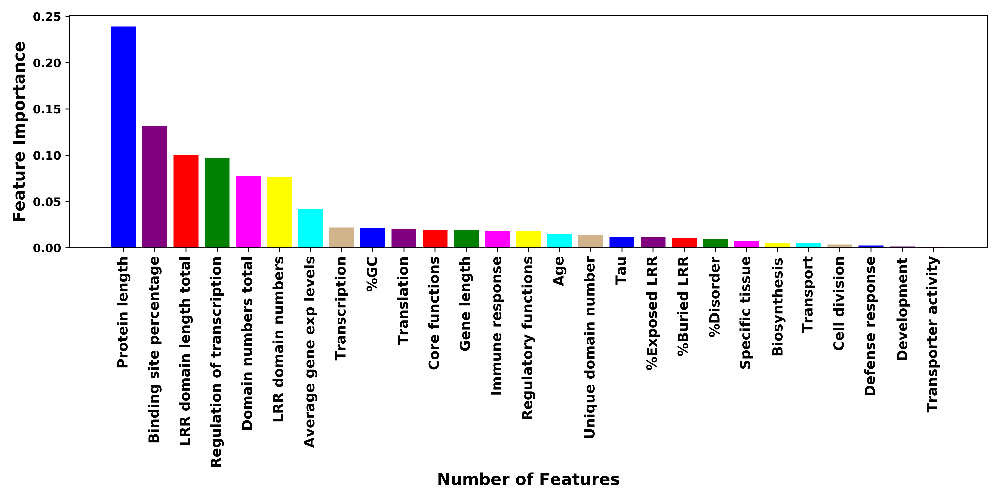
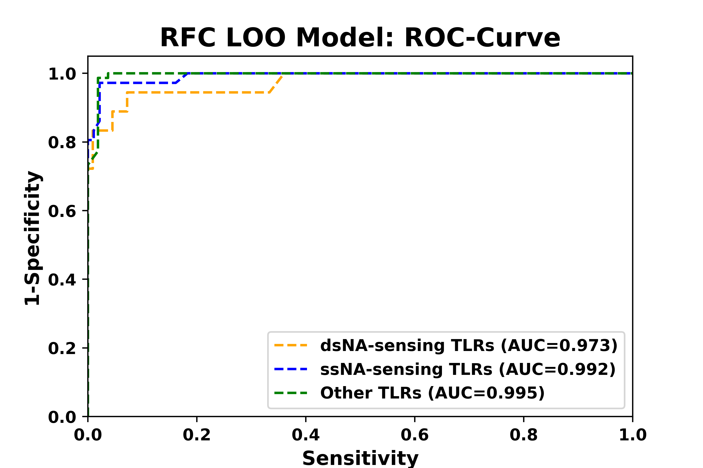

# TLRs - pathogen nucleic acid specificity prediction

<html>
<head>
</head>
<body>
  
<p align="justify">To understand the dynamics of pathogen-specific host responses, we identified some key sequence, expression and function related features of nucleic acid sensing Toll-like receptor proteins of the host. Our findings suggest that such host-specific features are directly related to the strand (single or double) specificity of nucleic acid from pathogens. Therefore, we developed a model to predict the pathogen nucleic acid strand specificity of TLRs as follows.</p>

<br>

## RFC-LOO (Random Forest Classifier - Leave One Out) model

### Training of model
<p align="justify">The model is trained on 27 features of 129 TLR proteins of 16 species that includes sequence network evolutionary features, gene expression features and functional annotation features. All the sub features and their estimations are defined in the method section of publication (under review).</p> 

<p align="justify">The estimated values of all the features are used to create a tab separated file called “training_input.txt”, located in the <i>Data</i> folder and used to train the model with the below mentioned command by utilizing <b>Training_model.py</b> python script. 

```p
$ python3 Training_model.py Data/training_input.txt Doc
```
Here Doc is the folder name that contains all the performance measure files.

<p align="justify">The trained model also summarizes the important features of TLRs that could be critical for nucleic acid strand specificity prediction (brought up below).</p> 

<div align="center"><br></div>
<br>

### Best model and its performance
<p align="justify">The best trained model RFC-LOO_model.pkl is generated by the <b>Training_model.py</b> python script and saved in the <i>Src</i> folder for further use. The overall performance and the ROC curve represents that the RFC-LOO_model is trained well as described below and good enough to predict the pathogen nucleic acid specificity of TLRs.</p>  

<p align="justify"><b> The overall Accuracy of RFC-LOO model: 0.946 </b><br>
<b>The overall Matthews correlation coefficient of RFC-LOO model: 0.903 </b></p>

<div align="center"><br></div>
<br>

### Predicting TLR specificity

<p align="justify"> This repository provides the source code (<b>specificity_prediction.py</b>) for predicting nucleic acid strand specificity of pathogens sensed by uncharacterized TLRs. Our best trained <b> RFC-LOO_model.pkl </b> serves as a <b> predictor </b> to identify the specificity of novel and blind set TLRs (mentioned in “prediction_input.txt” file).</p>

#### Conditions

<p align="justify">The predictor was developed in python version 3 and above. It is necessary to install the sklearn, joblib, matplotlib and seanorn libraries to run the predictor.</p> 

#### Steps

1. Extract all the features and create a tab separated file as described in the format provided in the “prediction_input.txt” file. 

2. Run the <b>specificity_prediction.py</b> python script using the following command
   
```p
$ python3 specificity_prediction.py <input_file>
```
Here, input_file is “prediction_input.txt” which contains aforementioned feature values for novel and blind set TLRs. 

3. Predicted specificity for uncharacterized TLRs is shown below as well as written in the “TLR_specificity_prediction.tsv” file.

<table align="center">
  <tr> <th colspan="2"> Novel set TLRs specificity prediction: </th> </tr>
  <tr> <td> sTLR18 </td> <td> other </td> </tr>
  <tr> <td> sTLR25a </td> <td> other </td> </tr>
  <tr> <td> sTLR25b </td> <td> other </td> </tr>
  <tr> <td> nTLR25 </td> <td> other </td> </tr>
  <tr> <td> sTLR27 </td> <td> other </td> </tr>
  <tr> <th colspan="2"> Blind set TLRs specificity prediction: </th> </tr>
  <tr> <td> aTLR9 </td> <td> ss </td> </tr>
  <tr> <td> aTLR18 </td> <td> other </td> </tr>
  </table>
  
<br>

</body>
</html>


